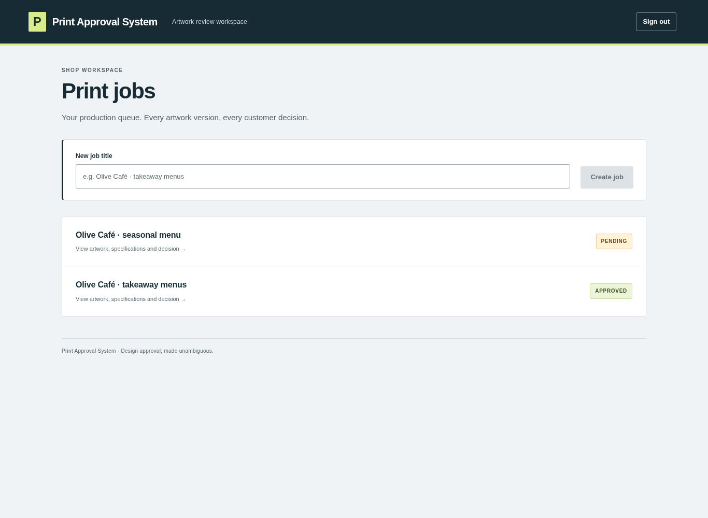
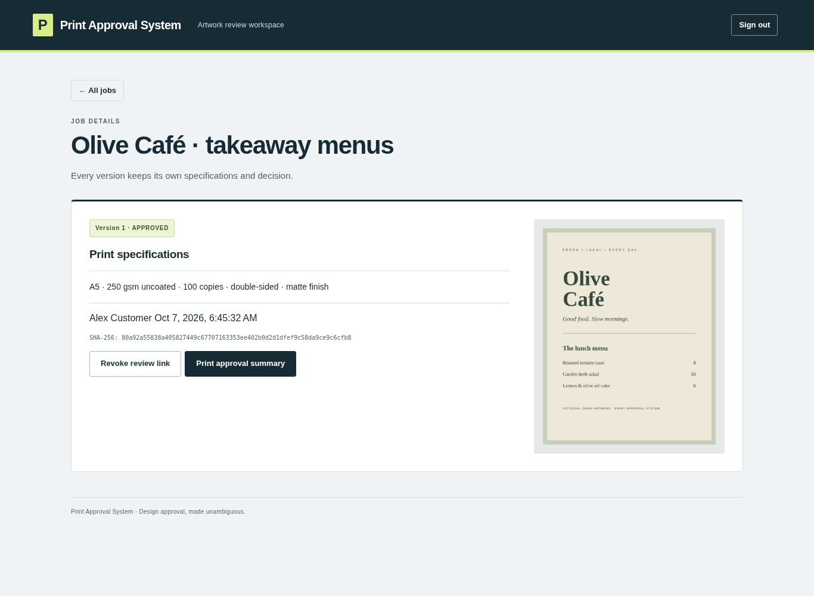
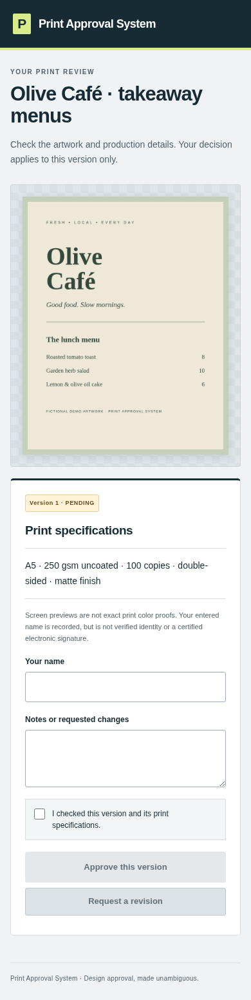
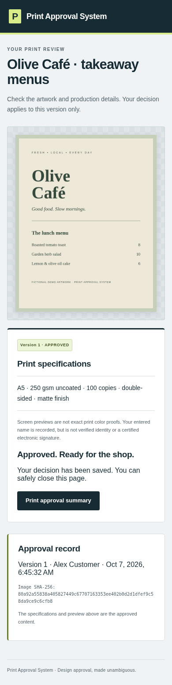
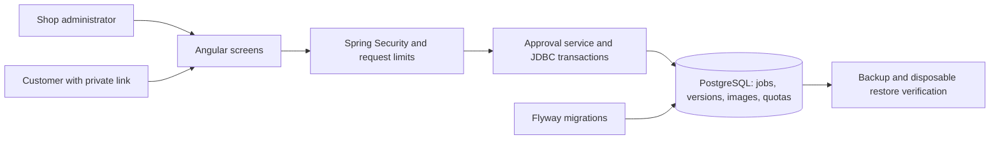

# Print Approval System

A small print shop gets an unambiguous decision on a specific preview and its print specifications before production. A customer can approve or request changes without creating an account.

## Screenshots

Captured from the running production container with fictional café data. These are real application screens, not mockups.







## Stack and architecture

| Layer | Choice | Reason |
| --- | --- | --- |
| Frontend | Angular 21, TypeScript 5.9 | Strict templates and a compact responsive three-screen workflow |
| Backend | Java 21, Spring Boot 4.1.1 | One deployable service with authentication, validation and transaction boundaries |
| Persistence | PostgreSQL 17.11, JDBC, Flyway | Explicit concurrency locks, version history and reproducible migrations |
| Private previews | Normalized PNGs in PostgreSQL | Authorization on every read and one consistent backup |
| Verification | JUnit, PostgreSQL integration tests, Playwright, axe-core | State guards, browser journeys and focused accessibility checks |
| Packaging | Docker Compose, GitHub Actions | Reproducible local startup and commit-linked verification |



Tradeoffs: database image storage simplifies privacy and backups but increases database size; one shop account keeps setup small but excludes multi-tenant SaaS; process-local throttling avoids another service but requires edge controls for multiple instances. See [architecture and ADRs](docs/architecture.md).

## Complete, deliberately small

1. Sign into the shop workspace and create a job.
2. Save a JPG/PNG preview with size, stock, quantity, sides and finish.
3. Create a private review link and send it using your existing communication channel.
4. The customer checks the mobile preview and specifications, enters a name, then approves or requests a revision.
5. Print the approved record. Approved jobs are locked; new work requires a new job.

Old versions remain visible to the shop. A new version blocks approval of an earlier pending version. Replacing a link invalidates the old one; revocation prevents both viewing and submission. Duplicate identical decisions return the original result, including its timestamp.

Customer-entered names are **not verified identity** or certified electronic signatures. Screen images are **not exact print color proofs**. No claims of legal certification, customer adoption, revenue, or production readiness are made.

## Run locally with Docker

Requirements: Docker Engine and Compose v2, a browser, and enough memory for Java/Node image builds. All work for this delivery was performed in a cloud container.

```sh
cp .env.example .env
# Replace BOTH password placeholders. Administrator password must be at least 16 characters.
docker compose up --build -d
```

Open http://localhost:8080. The administrator username is internally fixed to `admin`; the screen asks only for the configured password. The local Compose port is bound to loopback and uses HTTP cookies. Do not expose this configuration directly to the Internet.

There are no seeded accounts, jobs or public demo links. Create sample content manually using [the demo](docs/demo.md). Database storage persists in `proof-data`.

## Development and tests

Java **21 JDK** (a JRE is insufficient), Maven **3.9.11**, Node **24.19.0**, npm, PostgreSQL **17.11**.

```sh
# Use a separate disposable test database, never production.
export DB_URL=jdbc:postgresql://localhost:55432/print-approval-system
export DB_PASSWORD=your-local-db-password
export ADMIN_PASSWORD=your-local-admin-password-at-least-16-chars
export COOKIE_SECURE=false
mvn -f backend/pom.xml verify
java -jar backend/target/print-approval-system-1.0.0.jar
# In another terminal, with the same environment:
cd frontend
npm ci
npm run build
npx tsc --noEmit
npm start
# In a third terminal:
cd frontend
npx playwright install chromium
npm test
```

Browser tests use http://localhost:4200 by default, or `BASE_URL`. `CHROMIUM_PATH` optionally selects an installed Chromium executable. Tests create disposable jobs and require the same `ADMIN_PASSWORD` as the server. Never point them at production.

The PostgreSQL-backed Spring suite covers lifecycle rules, concurrency, idempotent decisions, stale/revoked/rotated links, authorization, CSRF and upload validation. Playwright covers the real Angular UI, mobile approval, printable results, revisions, stale/revoked links, invalid credentials/files and network recovery. Angular production compilation uses strict TypeScript and template checks.

[Architecture and decisions](docs/architecture.md) · [API](docs/api.md) · [Operations](docs/runbook.md) · [QA evidence](docs/qa.md)

## Application safeguards

Login and public-link throttling, bounded uploads, transactional image-storage quotas, fixed error responses and sanitized application error logs are enabled by default. Quota failures preserve the previous proof. Executable backup/restore scripts verify restored images and storage accounting in a new disposable database. See [operating limits](docs/runbook.md) and [actual QA results](docs/qa.md); local safeguards do not replace TLS, production secrets, edge controls or monitoring.

## Market hypothesis and scope

Hypothesis: small print shops that currently reconcile approval across messages will pay for a simple per-shop workspace with an explicit version decision and printable record. This is unvalidated; there are no customer interviews or revenue claims. The next learning question is whether an owner and customer can complete a real approval without assistance, and whether the record reduces disputed reprints.

Concept references: [Jason Cohen's SLC framework](https://longform.asmartbear.com/slc/) and [Ayuprint terms](https://www.ayuprint.com/p/terms-conditions.html). The latter URL was supplied as inspiration but could not be retrieved during this build; no statement here is attributed to its contents. SLC means a complete narrow outcome, not verified production readiness.

Deliberately excluded: editor, AI/CDR/PDF rendering, payments, invoicing, messaging APIs, scheduling, analytics and multi-shop tenancy. Delight is a readable mobile proof and one-step decision with explicit recovery.
